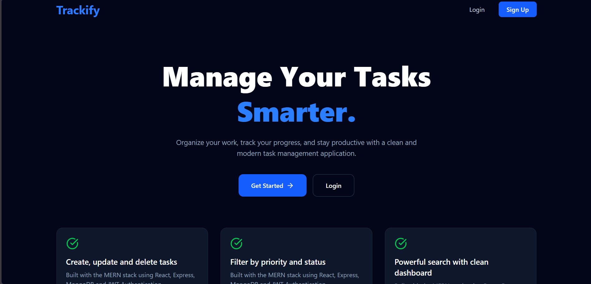
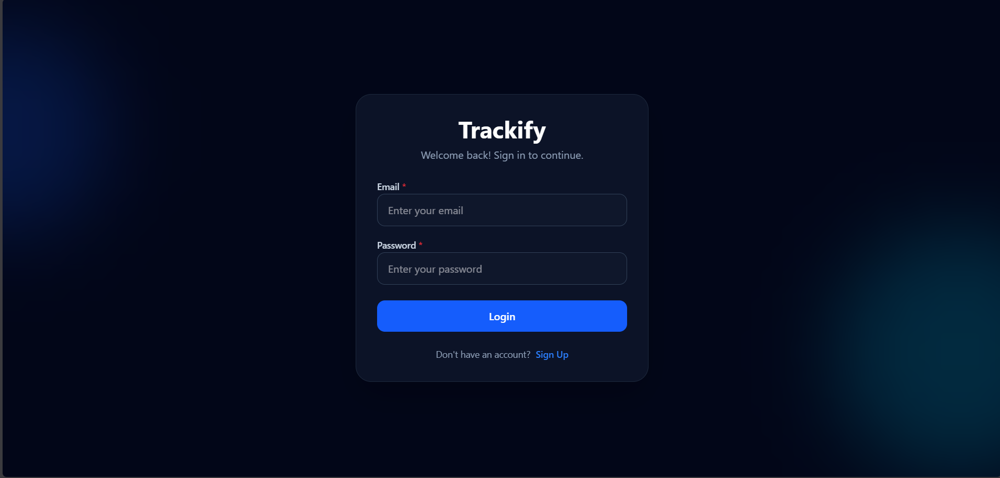
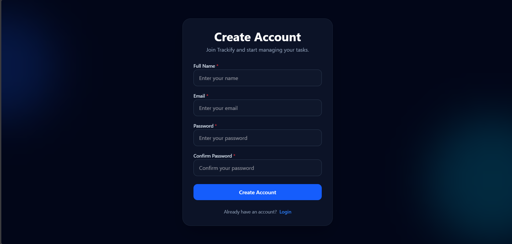
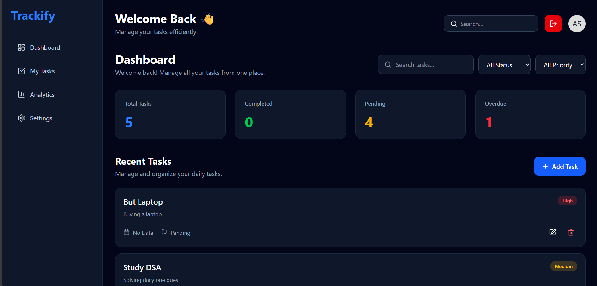
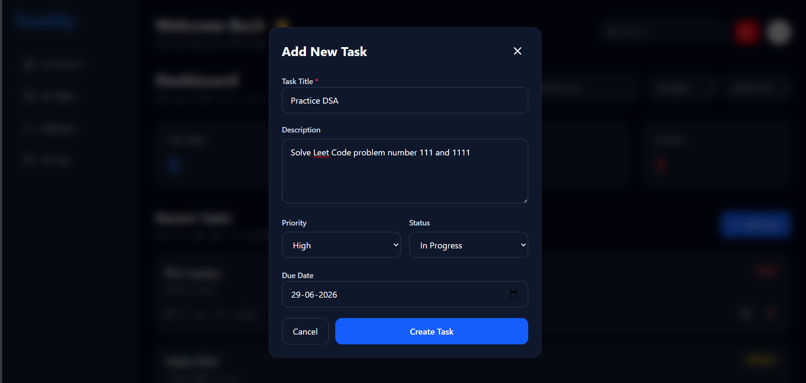

# 🚀 Trackify – MERN Task Management Application

Trackify is a full-stack task management application built using the MERN stack. It provides a clean and responsive interface where users can securely create an account, log in, and manage their daily tasks efficiently.

---

## 🌐 Live Demo

**Frontend (Vercel):**

> https://trackify-ashutosh.vercel.app

**Backend (Render):**

> https://trackify-vpr1.onrender.com/api/v1

---

## 📂 GitHub Repository

https://github.com/Ashutosh2128/Trackify

---

## ✨ Features

* 🔐 User Authentication (Signup & Login)
* 🔑 JWT-based Authentication
* 🛡️ Protected Routes
* 📝 Create Tasks
* ✏️ Edit Tasks
* 🗑️ Delete Tasks
* 📋 View All Tasks
* 📱 Responsive UI
* ☁️ MongoDB Atlas Database
* 🚀 Deployed on Vercel & Render

---

# 📸 Screenshots

## Landing Page



---

## Login Page



---

## Signup Page



---

## Dashboard



---

## Add Task



---

# 🛠️ Tech Stack

### Frontend

* React.js
* Vite
* Tailwind CSS
* Axios
* React Router DOM
* React Hot Toast
* Lucide React

### Backend

* Node.js
* Express.js
* MongoDB Atlas
* Mongoose
* JWT Authentication
* bcrypt
* Cookie Parser
* CORS

---

# 📁 Project Structure

```text
Trackify/
│
├── backend/
│   ├── config/
│   ├── controllers/
│   ├── middleware/
│   ├── models/
│   ├── routes/
│   ├── utils/
│   ├── server.js
│   └── package.json
│
├── public/
├── src/
│   ├── assest/
│   ├── components/
│   ├── constants/
│   ├── context/
│   ├── hooks/
│   ├── pages/
│   ├── routes/
│   ├── services/
│   ├── utils/
│   └── ...
│
└── README.md
```

---

# ⚙️ Installation

### Clone Repository

```bash
git clone https://github.com/Ashutosh2128/Trackify.git
```

---

### Install Frontend Dependencies

```bash
npm install
```

---

### Install Backend Dependencies

```bash
cd backend
npm install
```

---

### Configure Environment Variables

Create a `.env` file inside the `backend` folder.

```env
PORT=5000
MONGODB_URL=YOUR_MONGODB_CONNECTION_STRING
JWT_SECRET=YOUR_SECRET_KEY
```

---

### Start Backend

```bash
cd backend
npm run dev
```

---

### Start Frontend

```bash
npm run dev
```

---

# 🚀 Deployment

* **Frontend:** Vercel
* **Backend:** Render
* **Database:** MongoDB Atlas

---

# 👨‍💻 Author

**Ashutosh Prusty**

* GitHub: https://github.com/Ashutosh2128
* LinkedIn: https://www.linkedin.com/in/ashutosh-prusty-

---

## ⭐ If you like this project, consider giving it a star on GitHub!
